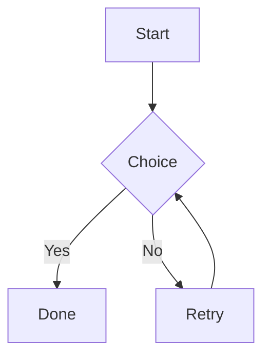
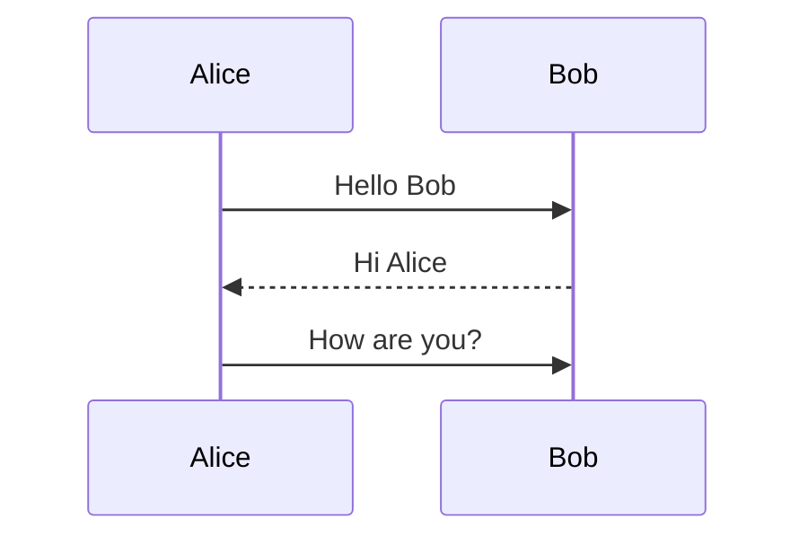
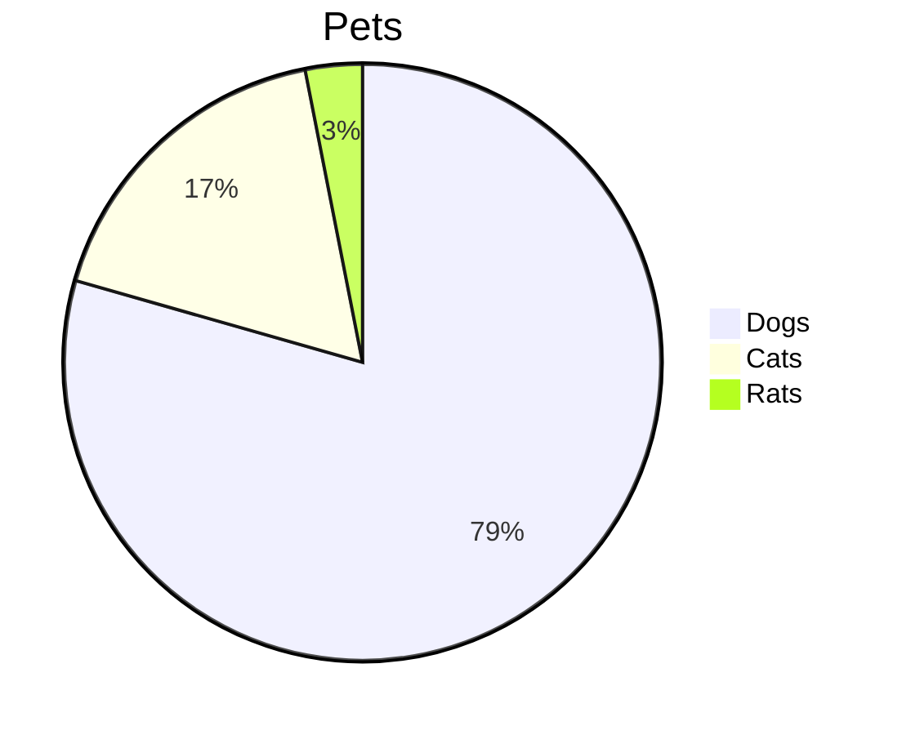
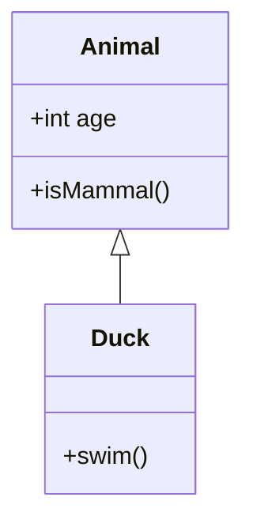
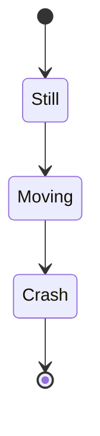

# Mermaid

A flowchart:

```mermaid
graph TD
  A[Start] --> B{Choice}
  B -->|Yes| C[Done]
  B -->|No| D[Retry]
  D --> B
```

A sequence diagram:

```mermaid
sequenceDiagram
  Alice->>Bob: Hello Bob
  Bob-->>Alice: Hi Alice
  Alice->>Bob: How are you?
```

A pie chart:

```mermaid
pie title Pets
  "Dogs" : 386
  "Cats" : 85
  "Rats" : 15
```

A class diagram:

```mermaid
classDiagram
  Animal <|-- Duck
  Animal : +int age
  Animal : +isMammal()
  Duck : +swim()
```

A state diagram:

```mermaid
stateDiagram-v2
  [*] --> Still
  Still --> Moving
  Moving --> Crash
  Crash --> [*]
```

A broken diagram:

```mermaid
graph TD
  A[Start --> 
```

The end.
