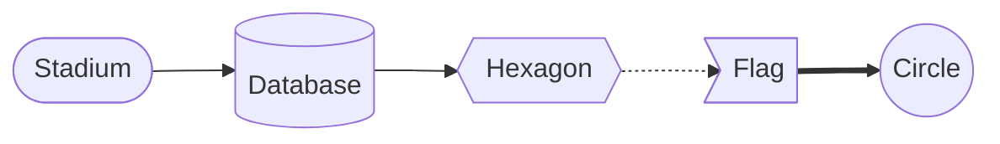
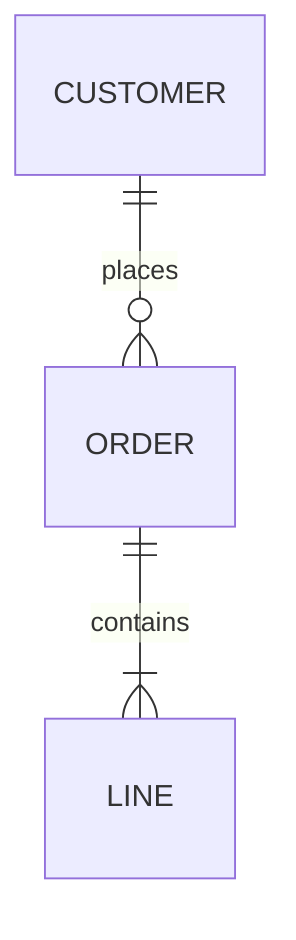
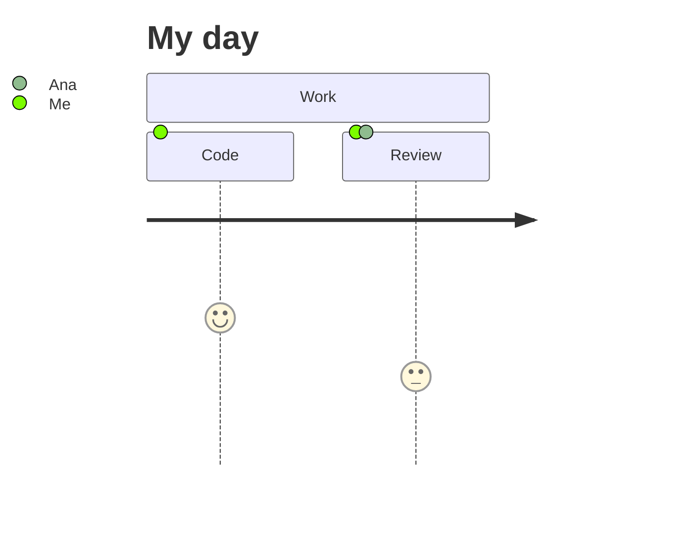
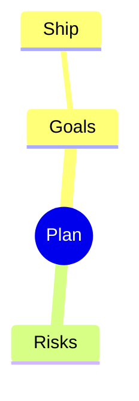
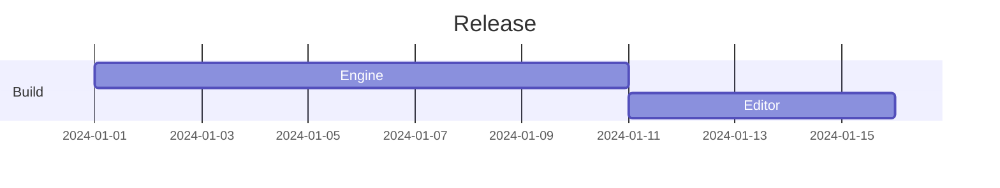

# Mermaid more

```mermaid
flowchart LR
  A([Stadium]) --> B[(Database)]
  B --> C{{Hexagon}}
  C -.-> D>Flag]
  D ==> E((Circle))
```

```mermaid
erDiagram
  CUSTOMER ||--o{ ORDER : places
  ORDER ||--|{ LINE : contains
```

```mermaid
journey
  title My day
  section Work
    Code: 5: Me
    Review: 3: Me, Ana
```

```mermaid
mindmap
  root((Plan))
    Goals
      Ship
    Risks
```

```mermaid
gantt
  title Release
  dateFormat YYYY-MM-DD
  section Build
  Engine :a1, 2024-01-01, 10d
  Editor :after a1, 5d
```

The end.
